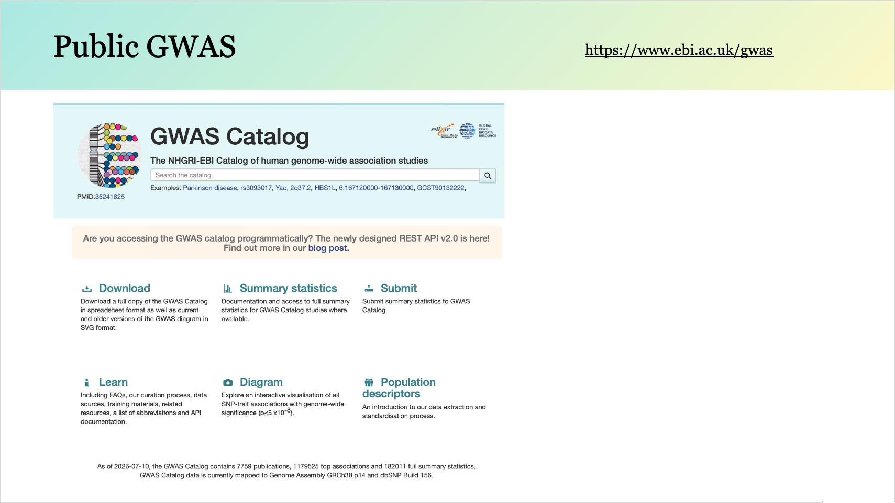
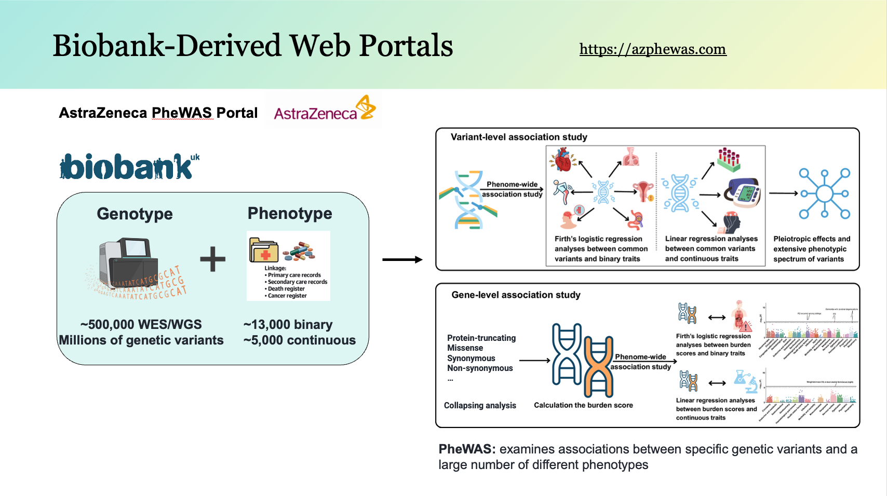
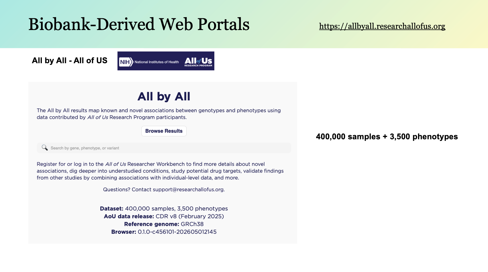
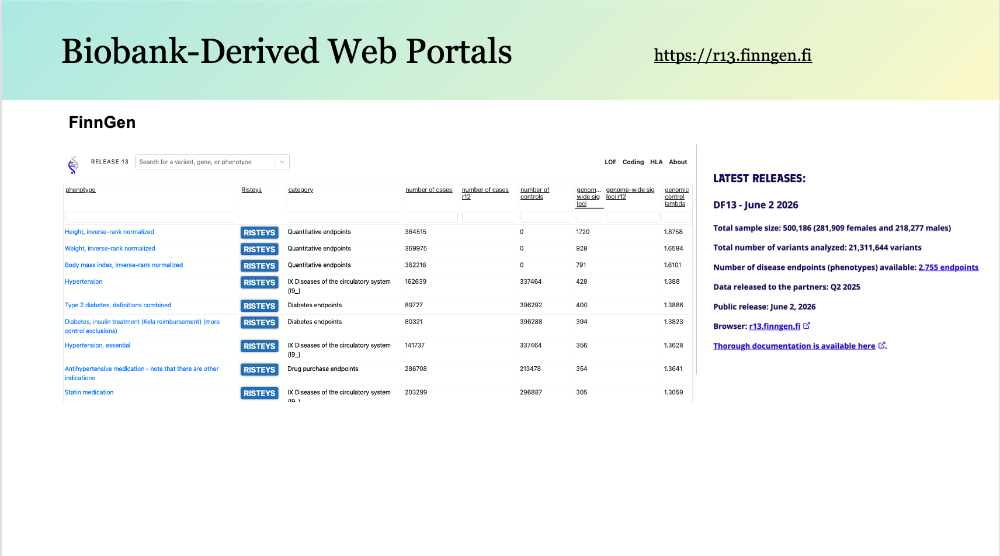
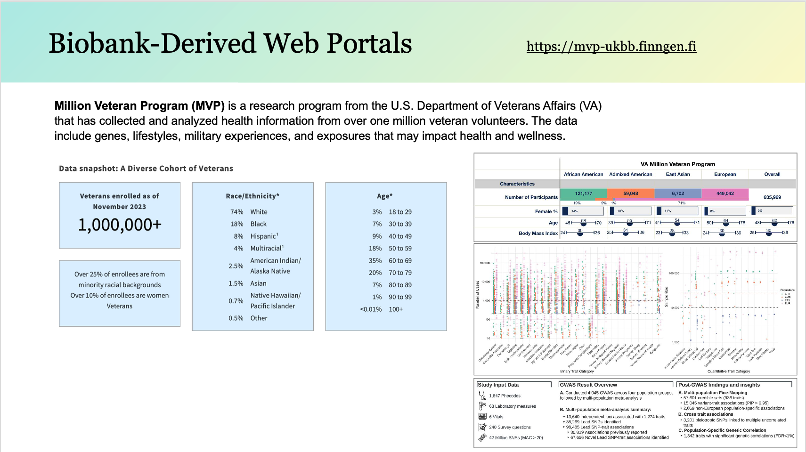
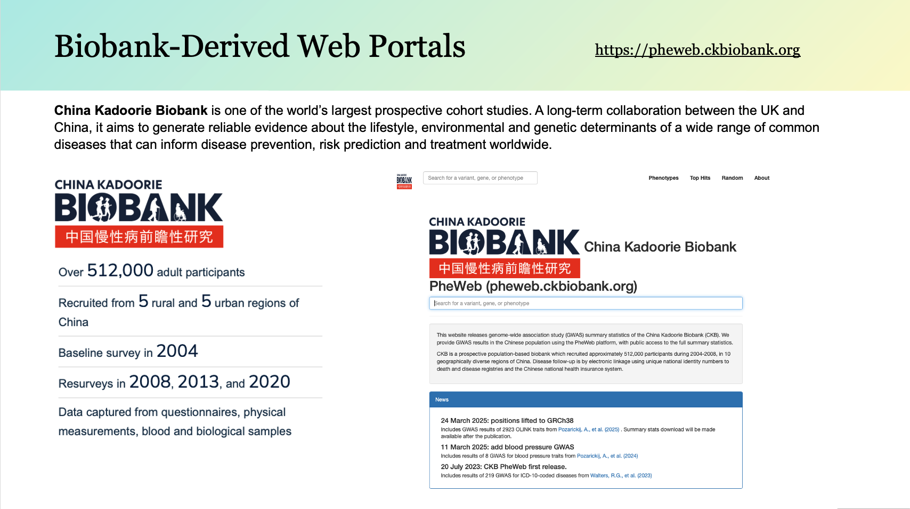
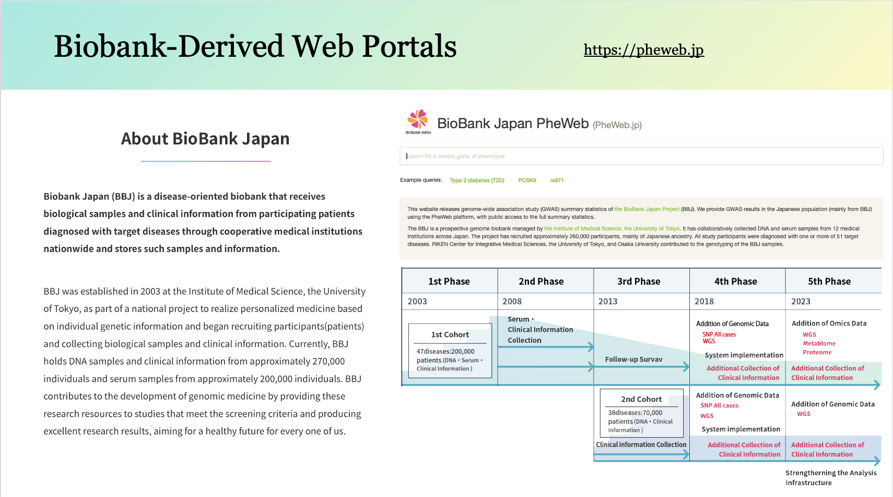
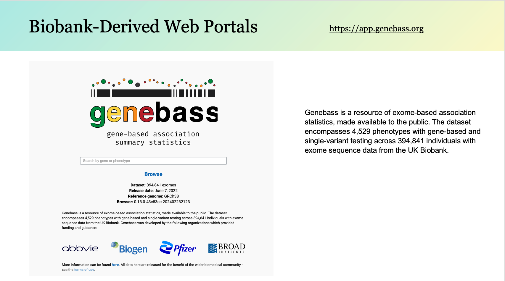
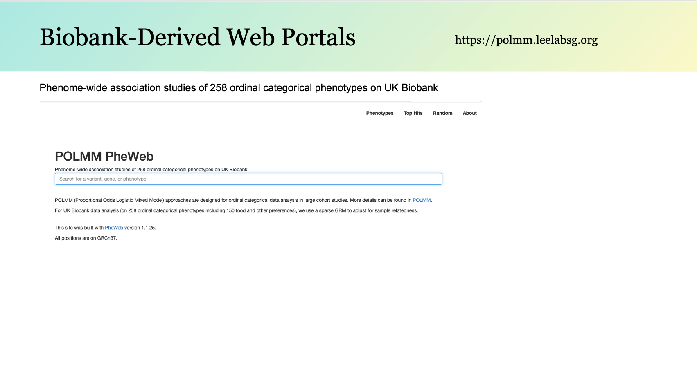
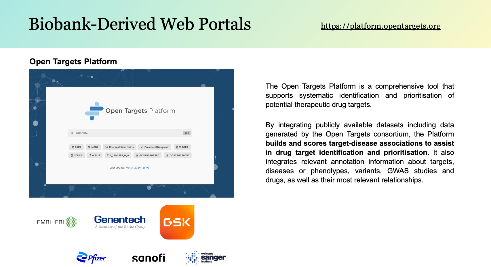

# 🌍🧬 GWAS / PheWAS / Biobank Portal Catalog

**Publicly available GWAS, PheWAS, and biobank-derived web portals** for genetic association studies, variant exploration, and phenotype discovery.

---

## 📚 Contents

- Public GWAS resources
- Biobank-derived PheWAS web portals
- Integrated resources

---

## 1. GWAS Catalog

🔗 **Website:** https://www.ebi.ac.uk/gwas

The NHGRI-EBI GWAS Catalog is the largest public repository of published human genome-wide association studies.

---

## 2. AstraZeneca PheWAS Portal

🔗 **Website:** https://azphewas.com

The AstraZeneca PheWAS Portal is a public repository of gene-phenotype associations. These data were generated using sequencing and phenotype data from the UK Biobank.

---

## 3. All by All

🔗 **Website:** https://allbyall.researchallofus.org

The All by All results map known and novel associations between genotypes and phenotypes using data contributed by All of Us Research Program participants.

---

## 4. FinnGen

🔗 **Website:** https://r13.finngen.fi

The genetic association results on this website are from the FinnGen study. These results are from 2,466 binary endpoints and 3 quantitative endpoints (HEIGHT_IRN, WEIGHT_IRN, BMI_IRN) from data freeze 13 (May 2025), consisting of 500,186 individuals.

---

## 5. Million Veteran Program (MVP)

🔗 **Website:** https://mvp-ukbb.finngen.fi

The genetic association results on this website represent a multi-way meta analysis. 
This current release contains 450 aligned disease endpoints/phecodes and lab measurements from
VA Million Veteran Program (3 analyses: n EUR=449,042; n AFR=121,177; n AMR=59,048)
FinnGen freeze 13 (n=500,186)
UKBB (pan-UKBB European subset n=420,531)

---

## 6. China Kadoorie Biobank

🔗 **Website:** https://pheweb.ckbiobank.org

This website releases genome-wide association study (GWAS) summary statistics of the China Kadoorie Biobank (CKB). CKB is a prospective population-based biobank which recruited approximately 512,000 participants during 2004-2008, in 10 geographically diverse regions of China. 

---

## 7. BioBank Japan PheWeb

🔗 **Website:** https://pheweb.jp

This website releases genome-wide association study (GWAS) summary statistics of the BioBank Japan Project (BBJ). The BBJ is a prospective genome biobank managed by the Institute of Medical Science, the University of Tokyo. It has collaboratively collected DNA and serum samples from 12 medical institutions across Japan. The project has recruited approximately 260,000 participants, mainly of Japanese ancestry. All study participants were diagnosed with one or more of 51 target diseases.

---

## 8. Genebass

🔗 **Website:** https://app.genebass.org

Gene-level rare variant association results from UK Biobank exome sequencing data.

---

## 9. POLMM UK Biobank

🔗 **Website:** https://polmm.leelabsg.org

Phenome-wide association studies of 258 ordinal categorical phenotypes on UK Biobank.

---

## 10. Open Targets Genetics

🔗 **Website:** https://platform.opentargets.org

The Open Targets Platform is a comprehensive tool that supports systematic identification and prioritisation of potential therapeutic drug targets. By integrating publicly available datasets including data generated by the Open Targets consortium, the Platform builds and scores target-disease associations to assist in drug target identification and prioritisation. It also integrates relevant annotation information about targets, diseases or phenotypes, variants, GWAS studies and drugs, as well as their most relevant relationships.

---

## ⭐ Citation

For citation information, please refer to the official website or documentation of each resource.
